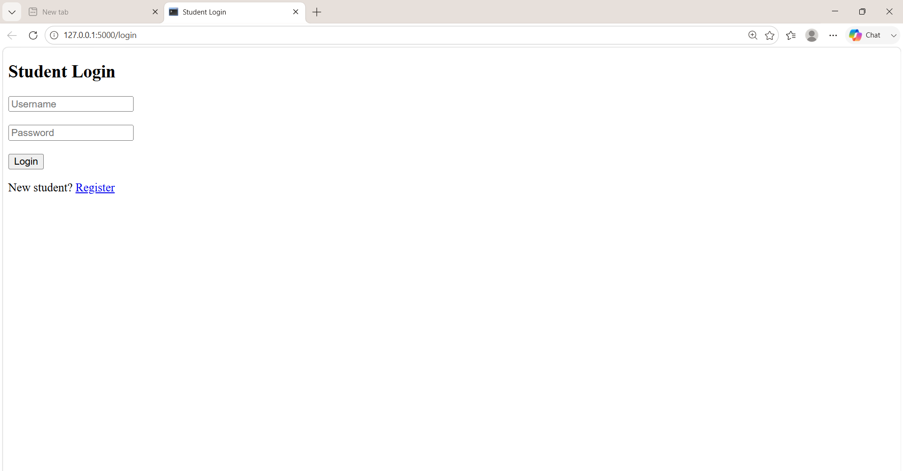
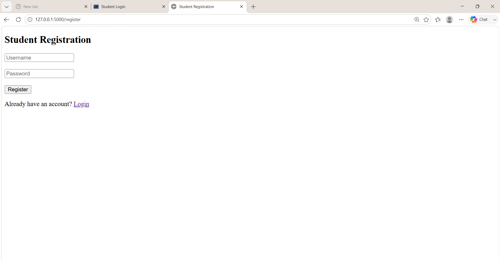
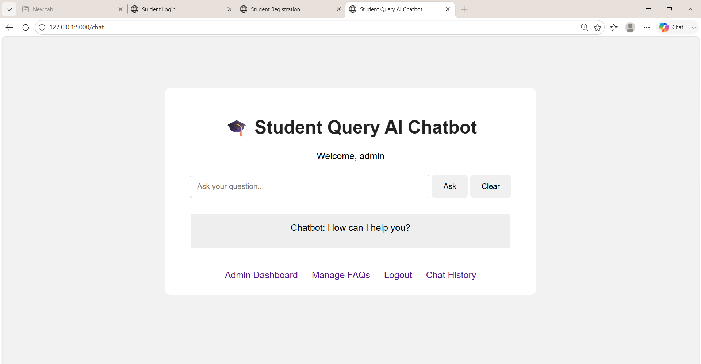
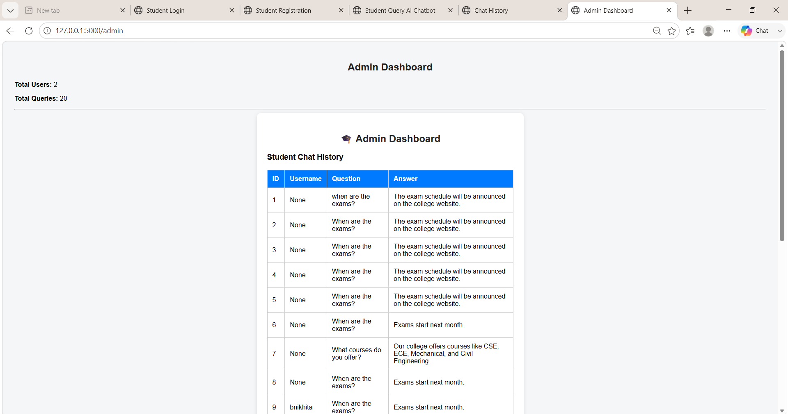
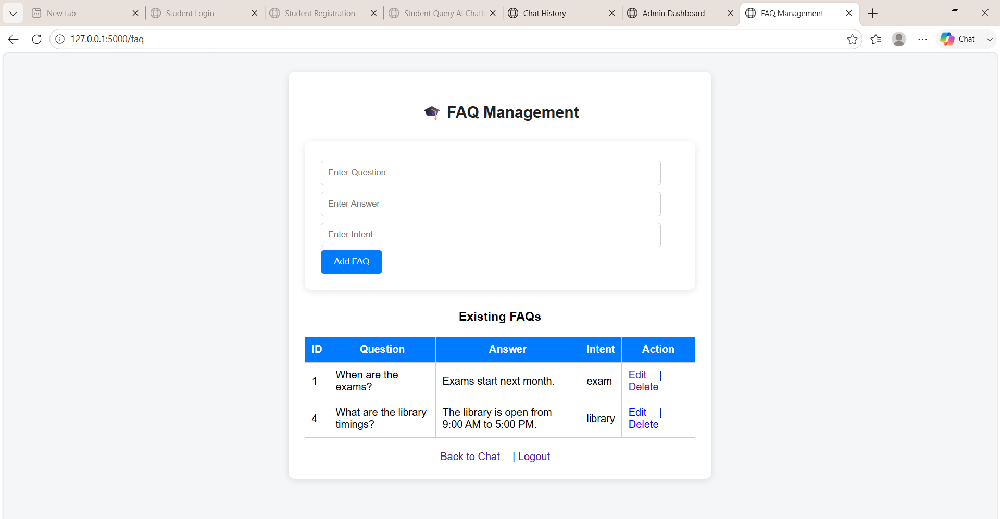

# Student Query AI Chatbot System

An AI-powered chatbot that helps students get answers to common college-related questions.

## Features

* Student Registration and Login
* AI-based Question Classification
* TF-IDF Text Vectorization
* Logistic Regression
* FAQ Management
* Chat History
* Admin Dashboard
* SQLite Database

## Technologies Used

* Python
* Flask
* Machine Learning
* NLP
* HTML
* CSS
* JavaScript
* SQLite
* Scikit-learn

## Project Architecture

Student
↓
Web Interface
↓
Flask Backend
↓
NLP Processing
↓
TF-IDF Vectorization
↓
Logistic Regression
↓
Intent Detection
↓
FAQ / Database
↓
Answer to Student

## Project Structure

- `app.py` – Flask application and web routes
- `train_model.py` – Trains the machine learning model
- `chatbot.py` – Chatbot prediction and responses
- `database.py` – SQLite database setup
- `dataset/` – Training dataset
- `model/` – Trained ML model
- `templates/` – HTML pages
- `static/` – CSS and JavaScript files

## How AI Works

Student Question
↓
TF-IDF
↓
Logistic Regression
↓
Intent Detection
↓
Answer

## Main Queries

* Exams
* Courses
* College Timing
* Library
* Hostel
* Fees
* Attendance
* Placements

## How to Run

Install the required packages:

```bash
pip install -r requirements.txt
```

Train the model:

```bash
python train_model.py
```

Run the application:

```bash
python app.py
```

Open in browser:

http://127.0.0.1:5000

## Future Enhancements

* RAG-based document support
* Voice-based queries
* College PDF support
* Cloud deployment

## Project Purpose

This project demonstrates the use of Python, Flask, NLP, Machine Learning, and SQLite to build an intelligent student support system.

## Screenshots

### Login


### Register


### Chatbot


### Admin Dashboard


### FAQ Management


