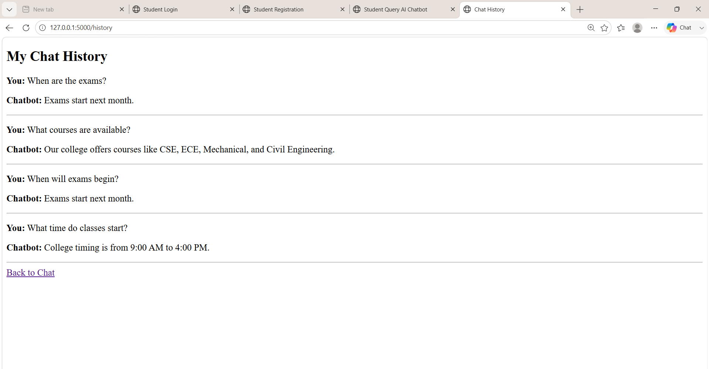

# Student Query AI Chatbot System

An AI-powered chatbot that helps students get answers to common college-related questions using Natural Language Processing and Machine Learning.

## Key Highlights

* AI-powered student query classification
* NLP-based text processing
* TF-IDF feature extraction
* Logistic Regression machine learning model
* Confidence-based response handling
* Student login and registration
* Secure password hashing
* SQLite database integration
* Chat history tracking
* Admin dashboard
* FAQ management
* Admin-only access control

## Features

* Student Registration and Login
* AI-based Question Classification
* TF-IDF Text Vectorization
* Logistic Regression
* FAQ Management
* Chat History
* Admin Dashboard
* SQLite Database

## Technologies Used

* Python
* Flask
* Machine Learning
* Natural Language Processing (NLP)
* HTML
* CSS
* JavaScript
* SQLite
* Scikit-learn

## Key Highlights

* Uses Machine Learning for student question classification
* Uses TF-IDF for text feature extraction
* Uses Logistic Regression for intent prediction
* Stores users and chat history using SQLite
* Provides FAQ management for administrators
* Provides an Admin Dashboard to monitor student queries
* Supports multiple college-related student queries

## Project Architecture

```text
Student
   ↓
Web Interface
   ↓
Flask Backend
   ↓
NLP Processing
   ↓
TF-IDF Vectorization
   ↓
Logistic Regression
   ↓
Intent Detection
   ↓
FAQ / Database
   ↓
Answer to Student
```

## Project Structure

```text
Student Query AI Chatbot/
│
├── app.py
├── train_model.py
├── chatbot.py
├── database.py
├── requirements.txt
│
├── dataset/
│   └── intents.csv
│
├── model/
│   └── chatbot_model.pkl
│
├── templates/
│   ├── login.html
│   ├── register.html
│   ├── chat.html
│   ├── history.html
│   ├── admin.html
│   ├── faq.html
│   └── edit_faq.html
│
├── static/
│   └── style.css
│
├── login.png
├── register.png
├── chatbot.png
├── chat_history.png
├── admin.png
└── faq.png
```

## How AI Works

The chatbot uses Machine Learning and NLP to understand student questions.

```text
Student Question
       ↓
TF-IDF Text Vectorization
       ↓
Logistic Regression Model
       ↓
Intent Prediction
       ↓
Confidence Check
       ↓
FAQ / Default Response
       ↓
Answer to Student
```

## Main Queries

The chatbot supports questions related to:

* Exams
* Courses
* College Timing
* Library
* Hostel
* Fees
* Attendance
* Placements

## Database Features

The system uses SQLite to store:

* User registration details
* Securely hashed passwords
* Student chat history
* Frequently Asked Questions (FAQs)

## Admin Features

The administrator can:

* View total registered users
* View total student queries
* Monitor chat history
* Add FAQs
* Edit FAQs
* Delete FAQs
* Manage chatbot responses

## How to Run

### Step 1: Open the Project Folder

```powershell
cd Desktop
cd "Student Query AI Chatbot"
```

### Step 2: Activate Virtual Environment

```powershell
.\venv\Scripts\activate
```

### Step 3: Install Required Packages

```bash
pip install -r requirements.txt
```

### Step 4: Train the Machine Learning Model

```bash
python train_model.py
```

Expected output:

```text
Model trained successfully!
```

### Step 5: Run the Application

```bash
python app.py
```

### Step 6: Open in Browser

```text
http://127.0.0.1:5000/login
```

## Login Pages

* Student Registration: `http://127.0.0.1:5000/register`
* Student Login: `http://127.0.0.1:5000/login`
* Chatbot: `http://127.0.0.1:5000/chat`
* Chat History: `http://127.0.0.1:5000/history`
* Admin Dashboard: `http://127.0.0.1:5000/admin`
* FAQ Management: `http://127.0.0.1:5000/faq`

## Screenshots

### Login


### Register


### Chatbot


### Chat History



### Admin Dashboard


### FAQ Management


## Future Enhancements

* Voice-based chatbot interaction
* College PDF-based RAG system
* Multi-language support
* Email notification system
* Mobile application version
* Advanced analytics dashboard

## Project Purpose

The purpose of this project is to provide students with a simple AI-powered platform for getting answers to common college-related questions quickly and easily.


